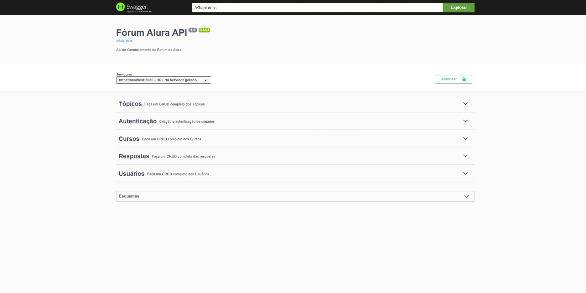
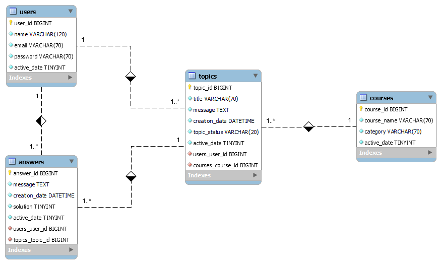
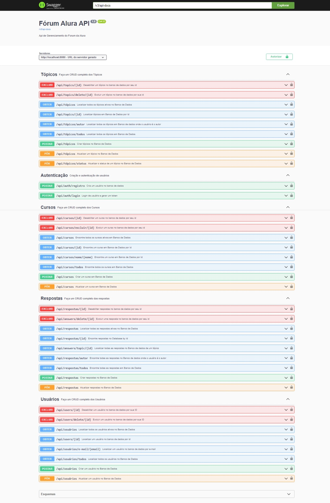

# forum-alura
Projeto Challenge ONE para replicar o Back And do forum da Alura fictício com os dados persistidos em um banco de dados MySQL desenvolvido utilizando o Framework Spring Boot.  

<h2>🛑 Preparação Ambiente</h2>

✅ Java JDK 17 
✅ Maven para gerenciamento do projeto 
✅ Framework Spring Boot 3   
✅ IDE para desenvolvimento Java (usarei IntelliJ) 
✅ Workbench 8 (MySql) para acesso ao banco de dados 
✅ GitHub para controle de versionamento 
✅ Postman para testar e desenvolver a API 

<h2> 	⌸ Diagrama do Banco de Dados</h2>
O  relacionamento das entidades da aplicação está disposto no seguinte diagrama: 

As tabelas do banco de dados seguem um padrão de colunas com ID(chave primária gerada de forma sequencial pelo banco), existe relacionamentos entre as tabelas através de chaves estrangeiras

<h2> Segurança e Validação da Api</h2>

Na segurança da API foi implementada o Spring Security, com autenticação via Token JWT e para documentação e teste da aplicação foi utilizada a biblioteca do OpenAPI Swagger.  
Para melhorar a persistência dos dados foi implentada classes validadoras onde verifica possiveis inconsistencias nos dados vindos das requisições e possiveis repetições de dados. 
Em conjunto com a utilização da biblioteca Validation.

<h2> ⚡ Funcionalidades </h2>
✅ Autenticação de usuário utilizando Token JWT, através do campo Email e Senha, para autorização de acesso aos demais Endpoint.

✅ CRUD completo dos Usuários, onde o campo email é único pois é utilizado no Login de Autenticação. 

✅ CRUD completo dos Cursos, onde não é permitido cursos com o mesmo nome, é possível realizar buscas nome do curso, e desabilitar um curso.                                                                    

✅ CRUD completo dos Tópicos, onde não é permitido tópicos que tenham o título e a mensagem iguais. 
É permitido fazer buscas , por curso, por author e por ano da postagem. É possível desabilitar e alterar o status do tópicos.

✅ CRUD completo das Respostas,  onde não é permitido respostas que tenham mensagem iguais num mesmo tópico.
É permitido fazer buscas , por author e por tópicos. É possível desabilitar respostas.

<h2> Layout da aplicação</h2>

<h2> 🌱 Dependencias do Maven</h2>
<h3>1. Banco de dados MySql </h3>
Utilizado o MySQL como Banco de Dados para persistência. 
 
<dependency> 
			<groupId>com.mysql</groupId>
			<artifactId>mysql-connector-j</artifactId>
			<scope>runtime</scope>
</dependency> 
<h3>2.  Spring Security </h3>
Estrutura de autenticação e controle de acesso altamente personalizável para aplicativos Spring. 
 
<dependency>
			<groupId>org.springframework.boot</groupId>
			<artifactId>spring-boot-starter-security</artifactId>
</dependency> 
<h3>3. Validation  </h3>	
Validação com Hibernate dos dados requeridos do usuário  
 
<dependency>
			<groupId>org.springframework.boot</groupId>
			<artifactId>spring-boot-starter-validation</artifactId>
</dependency> 
<h3>4. Spring Web </h3>
Crião Web, incluindo RESTful, usando o Spring MVC. Usa o Apache Tomcat como o contêiner incorporado padrão.  
 
<dependency>
			<groupId>org.springframework.boot</groupId>
			<artifactId>spring-boot-starter-web</artifactId>
</dependency> 
<h3> 5. Spring HATEOAS </h3> 
Facilita a criação de APIs RESTful que seguem o princípio HATEOAS ao incorporar links nos dados enviados ao usuário.  
 
<dependency>
			<groupId>org.springframework.boot</groupId>
			<artifactId>spring-boot-starter-hateoas</artifactId>
			<version>3.1.0</version>
</dependency> 
<h3>6. Spring Boot DevTools</h3>
Fornece reinicializações rápidas de aplicativos, LiveReload e configurações para uma experiência de desenvolvimento aprimorada.  
 
<dependency>
			<groupId>org.springframework.boot</groupId>
			<artifactId>spring-boot-devtools</artifactId>
			<scope>runtime</scope>
			<optional>true</optional>
</dependency> 
<h3>7.  Swagger UI</h3>
A interface do usuário do Swagger permite que qualquer pessoa visualize e interaja com os recursos da API
 
<dependency>
			<groupId>org.springdoc</groupId>
			<artifactId>springdoc-openapi-starter-webmvc-ui</artifactId>
			<version>2.0.4</version>
</dependency> 
<h3>8. Auth0 Java JWT </h3>
Um implementaçao Java da Json web Tokem (JWT) RFC-7519, usada na autenticacção de usuários.  
 
<dependency>
			<groupId>com.auth0</groupId>
			<artifactId>java-jwt</artifactId>
			<version>4.4.0</version>
</dependency>

